# All Mermaid Diagrams

> **Color Palette Reference**
> Indigo `#3730A3` · Blue `#2563EB` · Teal `#0D9488` · Green `#16A34A` · Amber `#D97706` · Red `#DC2626` · Slate `#475569` · Light Gray `#F3F4F6`

---

## Figure 0 — Token Generation: Stateless Loop vs. Architectural Gate

**Pattern:** Foundation — Token Generation  
**Priority:** Critical

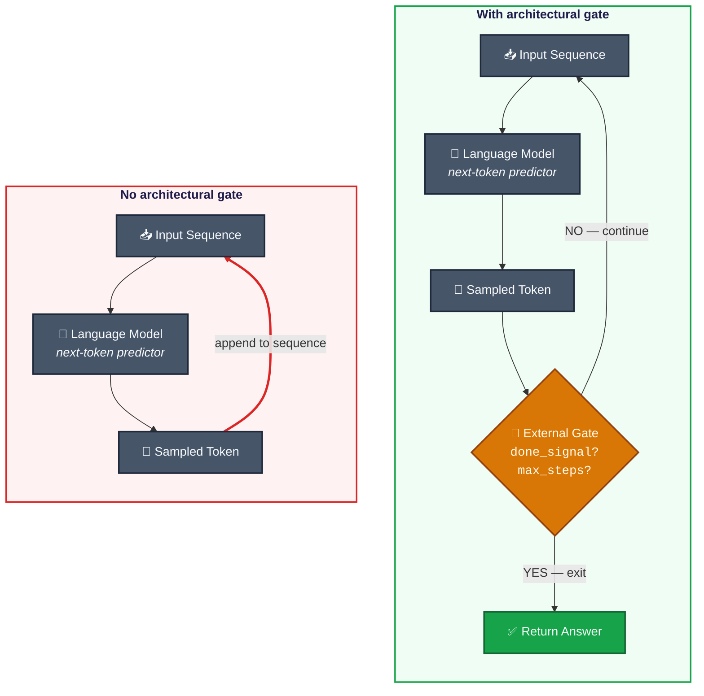

> **Left panel:** The token loop has no intrinsic exit — it runs until an external timeout or cost limit intervenes.  
> **Right panel:** An **External Gate** sits outside the model, evaluating `done_signal` or `max_steps`. Termination is an architectural property, not a model property.

*Figure 0. Token generation has no intrinsic termination condition (left). The loop limit and done signal are architectural gates that sit outside the model (right).*

---

## Figure 1 — ReAct: Think-Act-Observe Cycle with Dual Exit Paths

**Pattern:** ReAct  
**Priority:** Critical

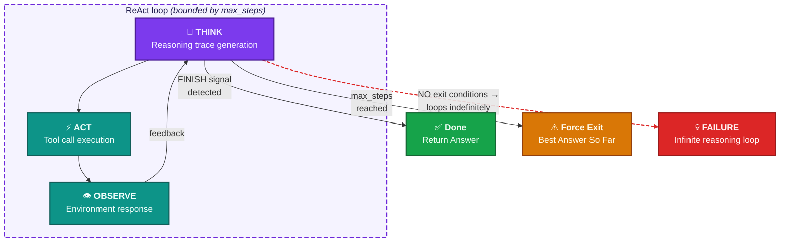

*Figure 1. Two exit conditions bound the ReAct loop. Removing either — especially max_steps — eliminates the architecture's only termination constraint.*

---

## Figure 2 — Plan-and-Execute: Stale Plan Failure Timeline

**Pattern:** Plan-and-Execute  
**Priority:** Critical

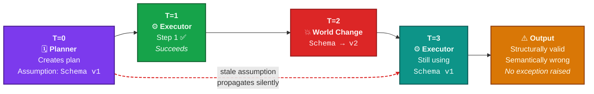

*Figure 2. The planner commits to Schema v1 at T=0. When the world changes at T=2, the executor has no mechanism to detect the divergence. The output looks correct. It is wrong.*

---

## Figure 2A — Plan-and-Execute: Normal State Architecture

**Pattern:** Plan-and-Execute  
**Priority:** Critical

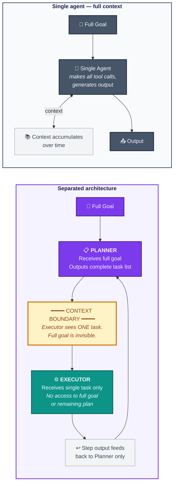

*Figure 2A. Separation means each component sees only what it needs. This prevents goal drift but creates the stale plan vulnerability — the executor cannot detect when its task assumptions are invalidated.*

---

## Figure 3 — Reflection: Convergence vs. Oscillation

**Pattern:** Reflection  
**Priority:** Critical

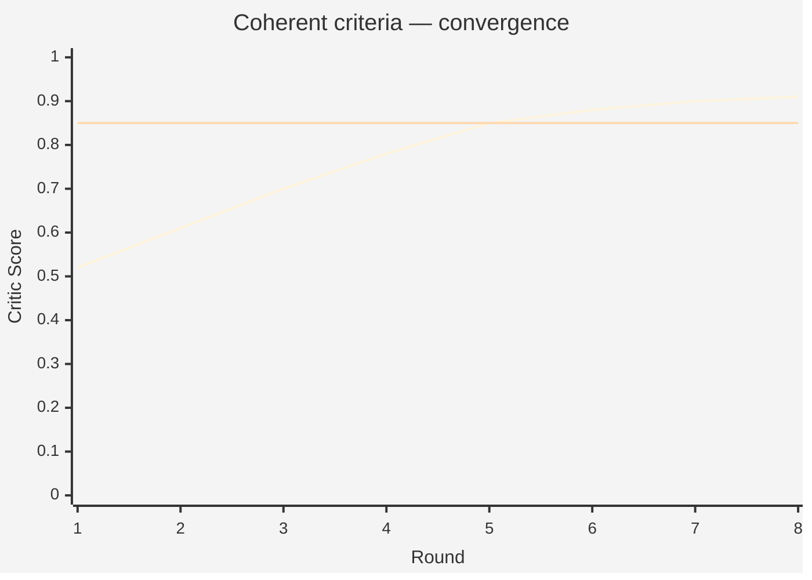

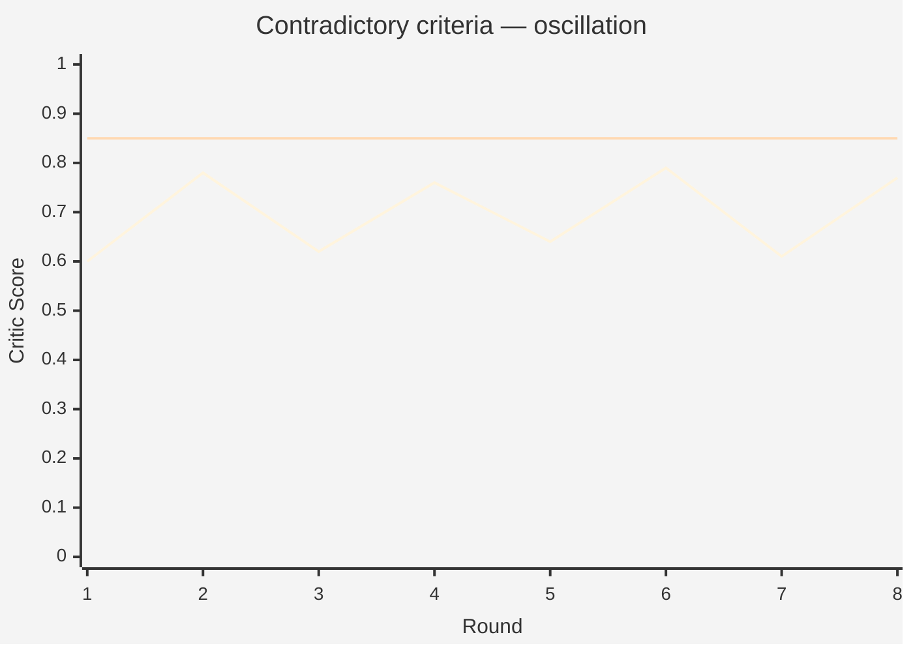

> **Left chart (Coherent criteria):** Blue score line rises monotonically from ~0.52 to ~0.91, crossing the 0.85 threshold at round 5. ✅ **Converged.**  
> **Right chart (Contradictory criteria):** Red score line alternates between ~0.60 and ~0.80 for all 8 rounds, never crossing threshold. ❌ **Never converges.**

*Figure 3. Oscillating scores are the diagnostic signature of contradictory criteria. The fix is always criteria revision — never model upgrade.*

---

## Figure 3A — Criteria Quality vs. Model Quality: Ablation Grid

**Pattern:** Reflection  
**Priority:** Critical

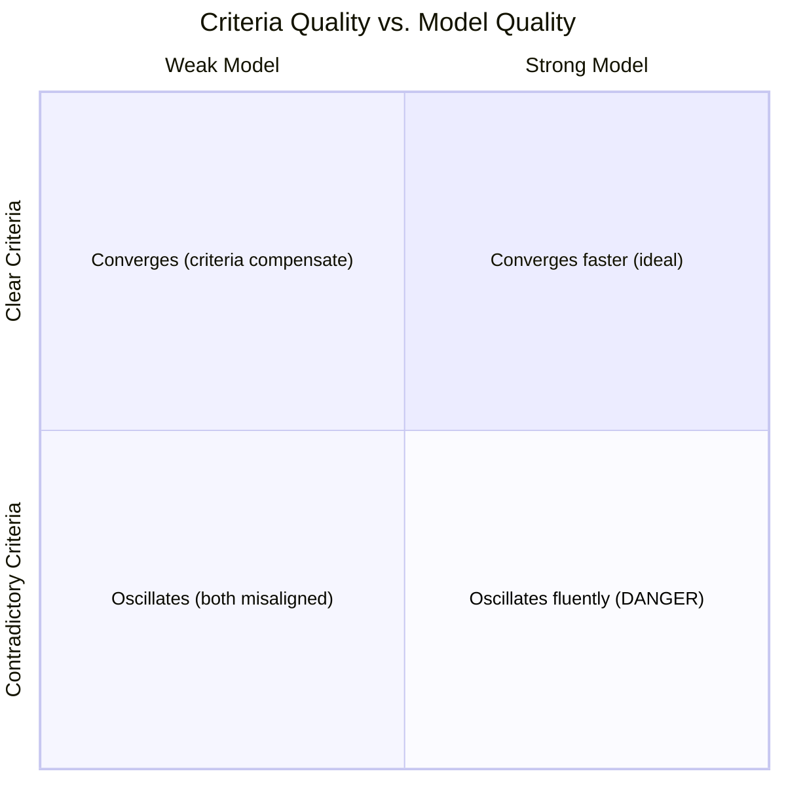

> | | **Weak Model** | **Strong Model** |
> |---|---|---|
> | **Clear Criteria** | ✅ Converges — criteria coherence compensates for model weakness | ✅ Converges faster — both factors aligned (ideal) |
> | **Contradictory Criteria** | ❌ Oscillates — both factors misaligned | ⚠️ **Oscillates fluently** — DANGER: failure is harder to detect |

*Figure 3A. Criteria quality is the actionable determinant. A stronger model with contradictory criteria oscillates more articulately — making the failure harder to detect, not easier to fix.*

---

## Figure 4 — Multi-Agent Topology and Deadlock

**Pattern:** Multi-Agent  
**Priority:** Critical

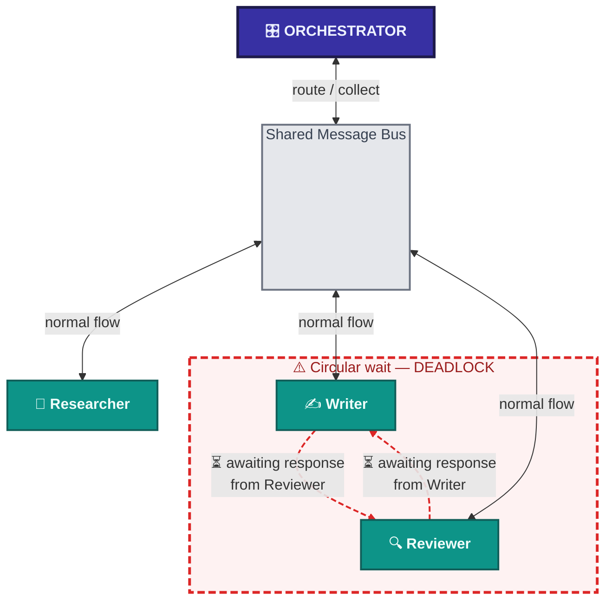

> **Legend:**
> - 🟦 Indigo = Orchestrator
> - 🟩 Teal = Specialist agents
> - ➡️ Blue arrows = Normal message flow
> - 🔴 Red dashed arrows = Deadlock circular-wait

*Figure 4. Deadlock is topological — it emerges from the handoff protocol, not from any individual agent's failure. Both agents are functioning correctly. Neither will proceed.*

---

## Figure 4A — Orchestrator Sequence Diagram

**Pattern:** Multi-Agent  
**Priority:** Critical

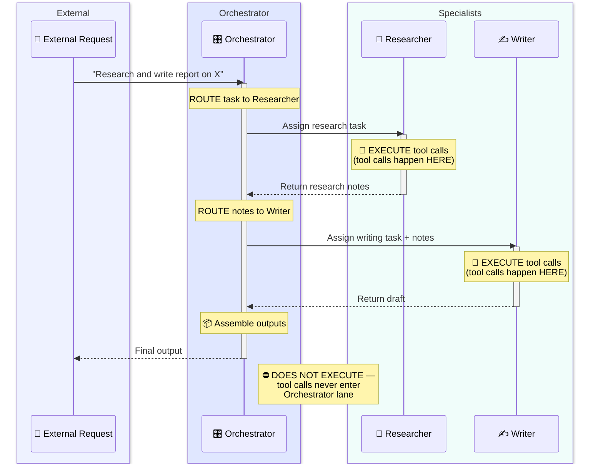

*Figure 4A. The Orchestrator routes and assembles. It never calls a tool directly. Execution is always inside the specialist's swim lane.*

---

## Figure 5 — Memory-Augmented Architecture and Context Poisoning

**Pattern:** Memory-Augmented  
**Priority:** Important

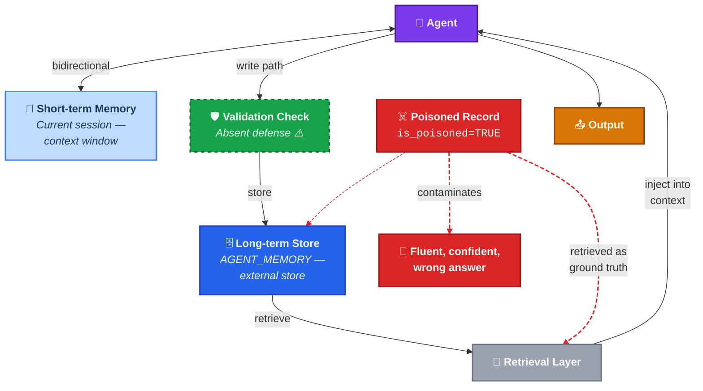

> **Poisoning path:** A poisoned record in the long-term store is indistinguishable from a valid record at retrieval time. The Validation Check sits on the **write** path — it cannot intercept a record already in the store.

*Figure 5. The retrieval layer trusts all stored memories equally. A poisoned record is indistinguishable from a valid one. The validation gate sits on the write path — it cannot intercept a record already in the store.*

---

## Figure 6 — Pattern Selection Decision Tree

**Pattern:** All Patterns — Selection Guide  
**Priority:** Important

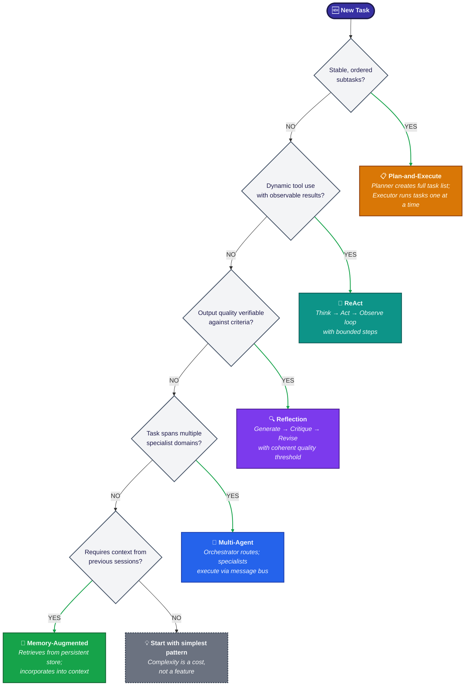

*Figure 6. Work through these questions in order. The first YES determines your pattern. If no YES is reached, the simplest pattern is the right choice.*

---

## Figure 7 — Capability vs. Architecture: Orthogonality Quadrant

**Pattern:** All Patterns — Failure Taxonomy  
**Priority:** Important

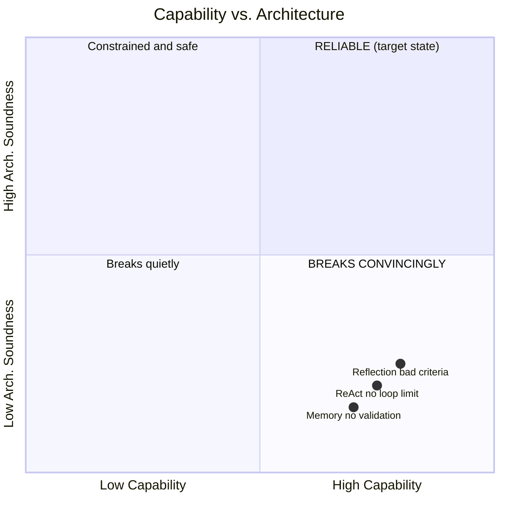

> **Bottom-right quadrant (DANGER ZONE)** contains all three example failure points:
> - ReAct without loop limit
> - Reflection with contradictory criteria
> - Memory without validation layer
>
> **Key insight:** Higher capability → more articulate failure → harder to detect.

*Figure 7. Model capability and architectural soundness operate on independent axes. Improving the model does not close an architectural gap — it makes the gap harder to see. The failure modes in this chapter all live in the bottom-right quadrant.*

---

> **End of diagrams.** See `figure_index.md` for the complete figure registry.
