# Chapter 4: Five Patterns, Five Trade-offs

## How the architecture you choose determines what breaks — not the model you use


> _Every agentic system failure is an architectural failure. The model executed exactly what the architecture permitted. The question is never why the model failed — it is why the architecture allowed it to._

---

## Learning Objectives

**1 — ReAct** _(Remember, L1)_
**Recall** the role of the loop limit as a termination constraint in ReAct agents, including the specific failure condition that results when the limit is absent or misconfigured.

**2 — Plan-and-Execute** _(Understand, L2)_
**Explain** why planner/executor separation introduces the risk of a stale plan when world state changes mid-execution, and what design assumptions make this failure predictable.

**3 — Reflection** _(Apply, L3)_
**Construct** a minimal reflection loop in Python that demonstrates oscillation behavior by deliberately supplying contradictory evaluation criteria, then identify the criteria change that resolves it.

**4 — Multi-Agent** _(Analyze, L4)_
**Diagnose** a coordination deadlock in a provided multi-agent system by tracing the handoff protocol to the specific design decision that produced circular dependency between agents.

**5 — Memory-Augmented** _(Evaluate, L5)_
**Evaluate** two competing memory validation gate designs for a given agent task, and justify which design provides stronger protection against context poisoning using explicit, evidence-based criteria.

> **Reader's note:** The **Pattern Selection Framework** — a five-question decision tree and trade-off table — is at the end of this chapter. If you are reading as a reference and already know your use case, jump there directly. If this is your first pass: work through the patterns in order — the decision tree assumes you can name each pattern's failure mode before asking you to choose between them.

---

## The Illusion of the Smart Agent

The system worked. That is the important thing to understand first. In the developer's test environment, the agent did exactly what it was supposed to do: it browsed three sources, synthesized a research brief, responded to a round of feedback, and submitted a clean final document. The loop ran four times. It terminated. The output was good.

In production, the same agent ran for forty-seven minutes before the monitoring system cut it off. It had completed hundreds of reasoning cycles. It had never submitted a report.

The developer's first instinct was to blame the model. The model, after all, was the thing that seemed to be "thinking" — the thing deciding whether the report was finished, whether another revision was needed, whether the task was complete. Surely the model had made some error in judgment. Surely it had gotten confused.

It had not. The developer built an open loop and expected the model to close it. But a language model is not an agent with goals — it is a function that maps input text to a probability distribution over the next word. It does not evaluate whether a task is complete; it has no such evaluation. It produces the next token that is statistically likely given everything before it. That is all it does. Termination is not a model property. It is an architectural property. The architecture had no exit condition beyond the model's own assessment of completion. The model's assessment never converged. The architecture had no opinion about this. It simply kept running.

_(This scenario is drawn from a documented class of production failures in LLM-based agentic systems — agents that loop indefinitely until an external monitor intervenes — and is presented here as an illustrative instance of the architectural gap this chapter addresses; cf. Wang et al., 2024.)_

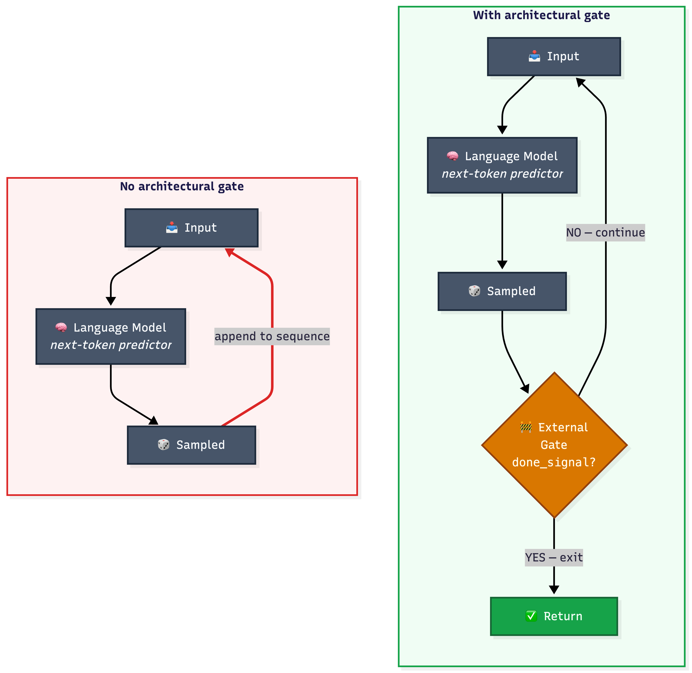
*Figure 0: Token generation has no intrinsic termination condition (left). The loop limit and done signal are architectural gates that sit outside the model (right).*

This is the central confusion that produces the majority of agentic system failures in practice: the belief that the model is the unit of control. It is not. The model is the engine. The architecture is the vehicle. An engine does not decide when to stop — that decision belongs to the structure built around it. When an agent loops forever, the question is not what the model was thinking. The question is what the architecture permitted.

This chapter is about five architectural patterns that prevent five specific failure modes. Each pattern is not a recipe for making agents smarter. Each pattern is a _constraint_ — a structural limitation on what the agent is allowed to do. Constraints are what make agents reliable. An agent without constraints is not powerful; it is uncontrollable. The five patterns we will examine are five different answers to the same question: _what structural boundary prevents the specific failure that would otherwise occur?_

For each pattern, we will build the working version, then deliberately break it. Because if you cannot produce the failure, you do not understand the architecture.

> **Before the patterns:** The live notebook begins with an **AI Scaffold** — an LLM-powered cell that takes a task description and proposes agent roles, tool definitions, and a recommended architectural pattern. The scaffold demonstrates what the LLM is good at (enumeration) and where it halts for human judgment (architectural trade-off evaluation). The LLM correctly identifies the roles and tools — but recommends Multi-Agent when simpler patterns may suffice. That gap between enumeration and judgment is the reason the five patterns that follow exist.

---

## Pattern 1: ReAct (Reasoning + Acting)

### The Scenario

A user asks an agent: "What was the GDP of France in 2023, and how does it compare to Germany's GDP in the same year?" The agent cannot answer this from memory alone — it needs to look up two separate figures, then perform a comparison. It must reason about what to search for, act by calling a search tool, observe the result, reason again about what it still needs, and act again. This is the task ReAct was designed for.

### The Mechanism

The ReAct pattern — introduced by Yao et al. (2022) and formalized as an interleaving of reasoning traces and action calls — operates through a three-step cycle that repeats until a termination condition is met.

In the first step, the agent generates a _thought_: a natural-language reasoning trace that articulates what it currently knows, what it does not know, and what action would be most useful next. This thought is not submitted to any external system. It is internal reasoning made explicit, and it serves two functions: it conditions the next action call, and it produces an interpretable audit trail of the agent's decision-making.

In the second step, the agent generates an _action_: a call to a specific tool in its registry, with specific parameters. The action is deterministic in the sense that it is a structured command — `search("France GDP 2023")`, for example — not a free-form request.

In the third step, the environment returns an _observation_: the actual output of the tool call. The observation is appended to the context, and the cycle begins again. The agent's next thought now has access to everything that came before: the original question, all prior thoughts, all prior actions, and all prior observations.

Termination occurs when the agent generates a thought that includes a `FINISH` signal — a designated token or structured output indicating the answer is ready — or when an external loop limit forces termination. Both exit paths are necessary: the done signal handles the happy path, and the loop limit handles every other path.

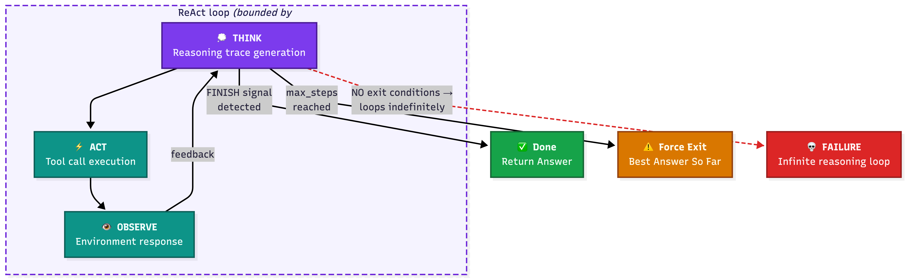
*Figure 1: Two exit conditions bound the ReAct loop. Removing either eliminates the architecture's only termination constraint.*

### The Design Decision

You build three things: a tool registry that defines which external actions the agent can take, a loop structure that alternates between reasoning and acting, and an exit condition that determines when the loop terminates. The tool registry is a whitelist — the agent cannot call tools that are not registered. This is a security boundary as much as a design choice.

```python
def react_loop(question, tools, max_steps=10):
    context = [{"role": "user", "content": question}]

    for step in range(max_steps):
        # Generate thought + action via Snowflake Cortex
        response = cortex_llm.complete(
            prompt=build_react_prompt(context),
            pattern_name="react",
            call_type="working"
        )
        thought, action, action_input = parse_react_response(response)

        # Check done condition BEFORE executing action
        if action == "FINISH":
            return action_input  # The final answer

        # Execute tool call from registry
        if action not in tools:
            observation = f"Error: tool '{action}' not in registry"
        else:
            observation = tools[action](action_input)

        # Append to context
        context.append({"role": "assistant", "content": response})
        context.append({"role": "user", "content": f"Observation: {observation}"})

    # Loop limit reached — return best available answer
    return extract_best_answer(context)
```

The loop limit (`max_steps`) is not optional. It is the architectural constraint that prevents runaway execution. The done signal is what makes the agent useful. The loop limit is what makes it safe. A system with only a done signal trusts the model to converge. A system with only a loop limit always fails with a timeout. You need both.

### The Failure Mode

**Infinite reasoning loop.** The causal chain: the loop limit is removed → the agent reasons without any convergence criterion → each reasoning step generates a new "I should also check..." thought → the agent never produces the `FINISH` signal → execution continues indefinitely → the session times out or exhausts the token budget.

This failure looks like intelligence. The agent is "being thorough." It is researching more, considering edge cases, refining its analysis. But it is not converging. Without the architectural constraint of a loop limit, thoroughness and infinite loops are indistinguishable. The logs will show a coherent chain of reasoning — each step logical, each tool call relevant — that simply never ends. The model is not malfunctioning. The architecture is missing a wall.

### The Exercise

Open the notebook. Find the cell labeled **"Pattern 1: ReAct — Working Demo."** Locate the `max_steps` variable, currently set to `10`. Change it to `None`. Run the cell. Observe how the agent continues reasoning long past the point where it has a sufficient answer, generating increasingly tangential search queries. Check the `LLM_CALL_LOG` table via `cortex_llm.get_call_history(pattern_name='react')` to see the token cost accumulate with each unnecessary iteration. Then restore `max_steps` to `10` and compare the outputs.

---

## Pattern 2: Plan-and-Execute

### The Scenario

A manager asks an agent to produce a quarterly business report. The agent must gather sales data from a database, pull market trends from a news API, write an executive summary, draft three section narratives, and format the final document. These steps have dependencies — you cannot write the executive summary before you have the data — and the order matters. The subtasks are known in advance and stable. This is the task Plan-and-Execute was designed for.

### The Mechanism

Plan-and-Execute separates the reasoning about _what to do_ from the reasoning about _how to do it_. A dedicated Planner component receives the high-level goal and produces a complete, ordered task list before any execution begins. A separate Executor component receives tasks one at a time and runs them using available tools.

The Planner operates once, at T=0. Its output is a structured plan: an ordered list of subtasks, each with a description, a set of required inputs, and a set of expected outputs. The Executor receives the first subtask and executes it. The output of that execution becomes an available input to the next subtask. The system proceeds sequentially until all tasks are complete or a failure condition is reached.

The separation between planner and executor is the core architectural idea. The planner reasons about the whole task at once. The executor focuses on one step at a time. This division prevents the executor from losing sight of the overall goal, and it prevents the planner from getting bogged down in execution details.

The critical design choice is whether the plan is _immutable_ — fixed at T=0 and executed without modification — or _revisable_ — subject to replanning when the executor encounters unexpected conditions. Immutable plans are simpler, faster, and more predictable. Revisable plans are more robust but introduce a new failure mode: the replanning decision itself can fail.

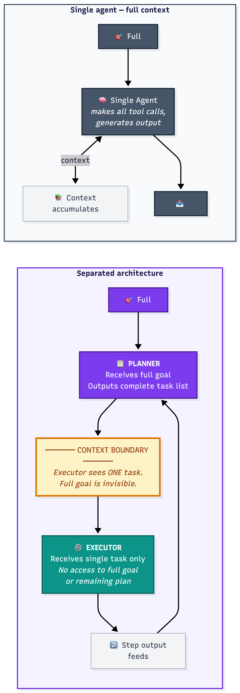
*Figure 2A: Separation means each component sees only what it needs. This prevents goal drift but creates the stale plan vulnerability.*

### The Design Decision

The two parameters you must configure are the replanning threshold and the plan validation step. The replanning threshold is the condition under which the system decides the original plan is no longer valid. The plan validation step is a structured check, performed before execution begins, that verifies the plan is internally consistent.

```python
def plan_and_execute(goal, planner, executor, tools, replan_threshold=2):
    # Phase 1: Planning — runs once at T=0
    plan = planner.generate_plan(goal)  # Calls Cortex for plan generation
    validate_plan(plan)                 # Check internal consistency
    plan_store.store_plan(plan.steps)   # Write to EXECUTION_PLANS table

    failures = 0
    results = {}

    for i, task in enumerate(plan.tasks):
        world_state = get_current_state()

        # Check if world state still matches plan assumptions
        if world_state_contradicts(task.assumptions, world_state):
            plan = planner.replan(goal, completed=results,
                                  failed_at=i, world_state=world_state)
            failures = 0

        try:
            task_input = {**task.inputs, **results}
            result = executor.execute(task, task_input, tools)
            results[task.output_key] = result
            plan_store.execute_step(i, result, world_state)  # Log to Snowflake

        except TaskFailure as e:
            failures += 1
            if failures >= replan_threshold:
                plan = planner.replan(goal, completed=results,
                                      failed_at=i, error=e)
                failures = 0

    return results
```

The `plan_store.execute_step()` call writes to the `EXECUTION_PLANS` table in Snowflake, creating a full audit trail of what was planned versus what happened. This is what makes the stale plan failure observable — you can query the table and see exactly where world state diverged from plan assumptions.

### The Failure Mode

**Stale plan execution.** The causal chain: the planner creates a plan at T=0 that assumes a specific external data source is available → at T=2, that data source returns a schema change or becomes unavailable → the executor, following the immutable plan, attempts to parse the response using the T=0 schema → the parsing produces structurally valid but semantically wrong data → downstream sections are written using incorrect figures → the final report contains internally consistent but factually wrong analysis.

The failure is particularly dangerous because it is silent. The system does not crash. It does not raise an exception. It produces output. The output looks like a report. Automated validation cannot catch it because the pipeline produces a structurally well-formed output at every step — no exception is raised, no schema is violated, no confidence score drops — and the semantic wrongness of the figures is only visible to someone who knows what the correct figures should be. The stale plan failure is only detectable by a human who reads the report carefully enough to notice that the numbers do not match the cited sources.

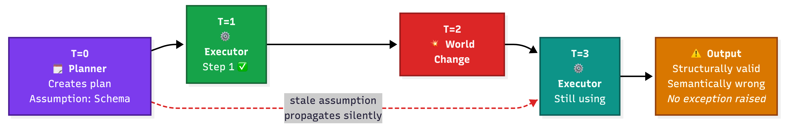
*Figure 2: The planner commits to Schema v1 at T=0. When the world changes at T=2, the executor has no mechanism to detect the divergence.*

### The Exercise

Open the notebook. Find the cell labeled **"Pattern 2: Plan-and-Execute — Working Demo."** After the plan is stored, add a call to `plan_store.inject_world_state_change(step_number=2)`. Run the full pipeline. Inspect the final output and identify the exact point at which the stale data propagates. Query the `EXECUTION_PLANS` table to see `is_stale = TRUE` on the affected step and compare the planned assumptions against the actual world state recorded at execution time.

---

## Pattern 3: Reflection / Self-Critique

### The Scenario

A code review agent is given a Python function and asked to improve it: fix bugs, improve readability, and optimize performance where possible. The agent's first draft may not satisfy all three criteria simultaneously. A single pass may fix the bugs but make the code less readable. A second pass may improve readability but reintroduce a subtle performance issue. The agent needs a structured mechanism for evaluating its own output against explicit criteria and iterating toward a version that satisfies all of them. This is the task Reflection was designed for.

### The Mechanism

The Reflection pattern separates a generative pass from an evaluative pass. A Generator produces an initial output. A Critic — which may be the same underlying model with a different prompt — evaluates that output against a set of explicit criteria and produces a structured critique with numeric scores. The Generator then revises the output based on the critique. This cycle repeats until either the Critic's score crosses a defined quality threshold or a maximum number of revision rounds is reached.

The evaluative pass is the architectural innovation. Without it, the generator has no signal about whether its output is improving. With it, the generator receives structured, criteria-specific feedback that conditions each revision.

Criteria quality is the more actionable determinant of the pattern's effectiveness. A stronger model with incoherent criteria will oscillate; a weaker model with precise, internally consistent criteria will converge. The failure mode described below is criteria failure, not model failure — which is why the fix is always criteria revision, never model upgrade.

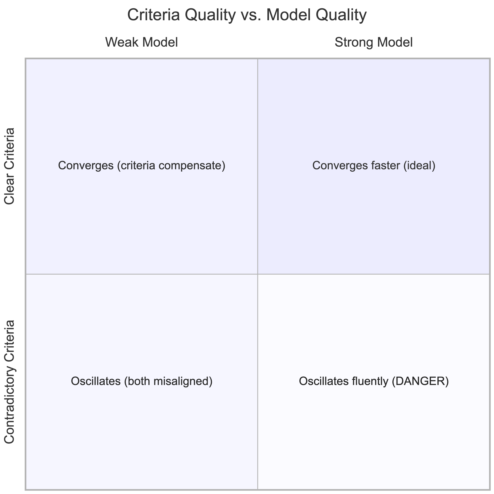
*Figure 3A: Criteria quality is the actionable determinant. A stronger model with contradictory criteria oscillates more articulately — making the failure harder to detect.*

The key insight is that the generator and the critic use the same underlying model, but with different prompts. The generator prompt says "write a thorough code review." The critic prompt says "score this review from 1–10 on completeness, accuracy, and specificity." The separation of concerns is in the prompts, not in the models. The architecture creates functionally distinct agents from a single model by switching the prompt frame: the generator prompt conditions the model to produce, and the critic prompt conditions the same model to evaluate. Because the model's output is a function of its input, a different instruction context produces a different output behavior. The separation of concerns is real — it lives in the prompts, not in the weights.

### The Design Decision

You must specify three things: the quality threshold (the minimum score at which the Critic considers the output acceptable), the maximum number of revision rounds (the loop limit that prevents infinite reflection), and the critic criteria (the explicit, non-contradictory standards against which output is evaluated). The criteria must be internally consistent. This is the most commonly overlooked constraint.

```python
def reflection_loop(task, quality_threshold=0.85, max_rounds=5):
    output = cortex_llm.complete(
        prompt=build_generator_prompt(task),
        pattern_name="reflection",
        call_type="working"
    )

    for round_num in range(1, max_rounds + 1):
        # Critic evaluates against explicit criteria
        eval_response = cortex_llm.complete(
            prompt=build_critic_prompt(output, CRITERIA),
            pattern_name="reflection",
            call_type="critique"
        )
        score, feedback = parse_evaluation(eval_response)

        # Log every round to Snowflake REFLECTION_ROUNDS table
        reflection_logger.log_round(
            round_number=round_num,
            generated_output=output,
            critic_score=score,
            critic_feedback=feedback,
            converged=(score >= quality_threshold)
        )

        if score >= quality_threshold:
            return output  # Convergence achieved

        # Generator revises based on structured critique
        output = cortex_llm.complete(
            prompt=build_revision_prompt(output, feedback),
            pattern_name="reflection",
            call_type="revision"
        )

    return output, Warning(f"Did not converge in {max_rounds} rounds. "
                           f"Final score: {score:.2f}")
```

The `reflection_logger.log_round()` call writes every iteration to `REFLECTION_ROUNDS`, enabling post-hoc analysis of how the score evolved and whether convergence was achievable. The fallback return after `max_rounds` is critical — it ensures the system always produces output, even if that output did not meet the threshold.

### The Failure Mode

**Non-converging reflection.** The causal chain: the criteria set includes two standards that cannot be simultaneously satisfied — for example, "maximize conciseness" and "include comprehensive inline documentation" → no output can satisfy both criteria simultaneously → the Generator produces output that satisfies one criterion → the Critic penalizes it for failing the other → the Generator revises to satisfy the second criterion → the Critic penalizes it for failing the first → the score oscillates between two values, neither of which crosses the threshold → the loop exhausts its round limit → the final output is whichever version happened to be produced last.

The oscillation is the diagnostic signature of contradictory criteria. If you observe a reflection system's scores across rounds and see alternating highs and lows rather than monotonic improvement, you are watching contradictory criteria in operation. The fix is not more rounds. The fix is criteria revision.

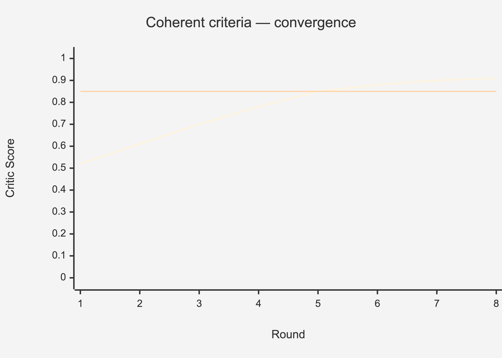
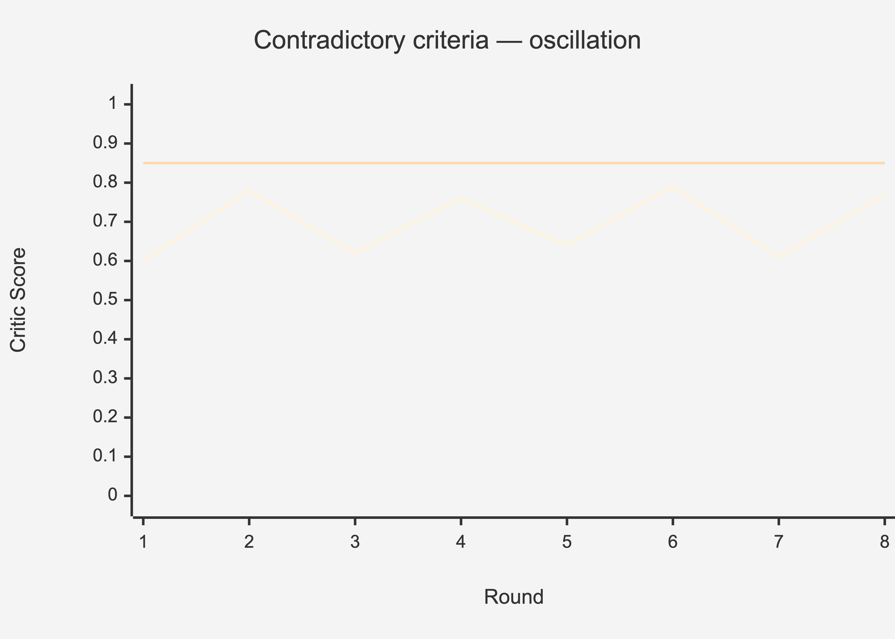
*Figure 3: Convergence (top) vs. oscillation (bottom). Oscillating scores are the diagnostic signature of contradictory criteria. The fix is always criteria revision — never model upgrade.*

### The Exercise

Open the notebook. Find the cell labeled **"Pattern 3: Reflection — Working Demo."** Modify the `CRITERIA` list to add two contradictory entries: `"Response must be under 50 words"` and `"Response must include at least three concrete examples with full explanation."` Set `max_rounds` to `8`. Run the cell. Use `reflection_logger.get_convergence_data(session_id)` to retrieve the round-by-round scores from Snowflake and plot the non-converging oscillation curve. Then remove one contradictory criterion and rerun. Compare the two convergence plots.

---

## Pattern 4: Multi-Agent Collaboration

### The Scenario

A content production pipeline must produce a published article on a technical topic. The task requires domain research, prose composition, and editorial review. Each role requires a different capability profile. A single agent cannot credibly perform all three roles simultaneously without degradation. This is the task Multi-Agent Collaboration was designed for.

### The Mechanism

The multi-agent pattern distributes a complex task across multiple specialized agents that communicate through a shared message bus. An Orchestrator agent receives the high-level goal, decomposes it into role-specific subtasks, routes each subtask to the appropriate specialist agent, and assembles the final output from the specialists' contributions.

Each specialist agent operates within a defined role boundary: a structured description of what it is responsible for, what it is not responsible for, and what format its outputs must conform to. The handoff protocol specifies how outputs are transferred between agents — what metadata accompanies the transfer, what acknowledgment is required, and what happens if the receiving agent cannot accept the handoff.

The message bus is the coupling and observability mechanism. It decouples agents from each other — the Researcher does not need to know the Writer exists. It also provides observability: every message is logged with sender, recipient, content, and delivery status in the `AGENT_MESSAGES` table. When something goes wrong, you can reconstruct the exact sequence of communications.

The Orchestrator does not execute tasks itself. It routes, monitors, and assembles. This separation is the source of the pattern's power and its fragility.

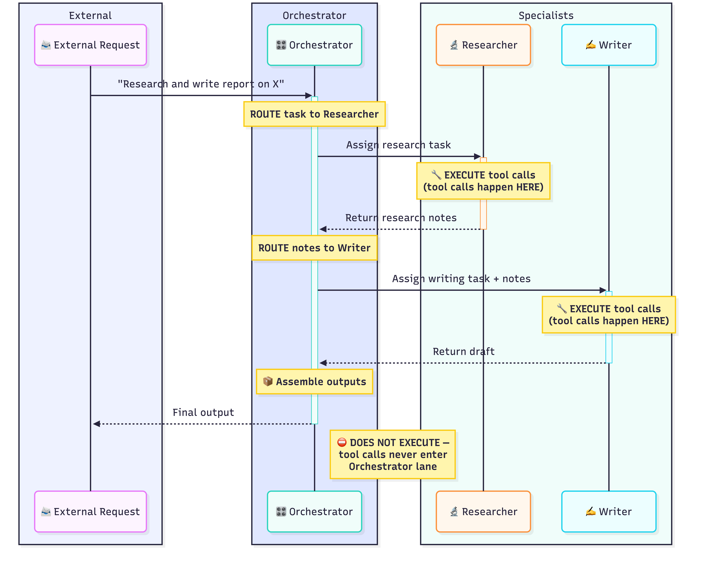
*Figure 4A: The Orchestrator routes and assembles. It never calls a tool directly. Execution is always inside the specialist's swim lane.*

### The Design Decision

The three architectural decisions are role boundary definition, handoff protocol specification, and timeout policy. Role boundaries must be mutually exclusive. Handoff protocols must include explicit acknowledgment — a message sent is not a message received. Timeout policy must specify what the system does when an agent fails to respond within a defined window.

```python
bus = AgentMessageBus(sf_conn, session_id)

# Orchestrator routes initial task
bus.send_message("orchestrator", "researcher", task_description)

# Researcher works, posts findings
research_output = researcher_agent.run(
    bus.receive_message("researcher", timeout_seconds=30)
)
bus.send_message("researcher", "writer", research_output)

# Writer drafts, posts to reviewer
draft = writer_agent.run(
    bus.receive_message("writer", timeout_seconds=30)
)
bus.send_message("writer", "reviewer", draft)

# Reviewer approves, returns to orchestrator
feedback = reviewer_agent.run(
    bus.receive_message("reviewer", timeout_seconds=30)
)
final = writer_agent.revise(draft, feedback)
```

The `timeout_seconds` parameter in `receive_message` is the constraint that converts a hang into a catchable error. Without it, a single unresponsive agent freezes the entire pipeline indefinitely. All messages are logged to the `AGENT_MESSAGES` table in Snowflake with sender, recipient, content, and status — making the coordination graph fully observable.

### The Failure Mode

**Coordination deadlock.** The causal chain: Agent A is configured to await Agent B's output before proceeding → Agent B is configured to await Agent A's output before proceeding → neither agent produces output because each is blocking on the other → both agents block indefinitely → the system hangs with no error message and no progress.

Deadlock is distinct from timeout. A timeout occurs when one agent takes too long. A deadlock occurs when agents are collectively waiting for each other — and neither will ever receive what it needs without the other acting first. Timeout policies catch individual agent failures. Deadlock requires cycle detection at the Orchestrator level. Without it, the `AGENT_MESSAGES` table will show two messages permanently stuck in `status = 'pending'`, each waiting for the other to resolve first.

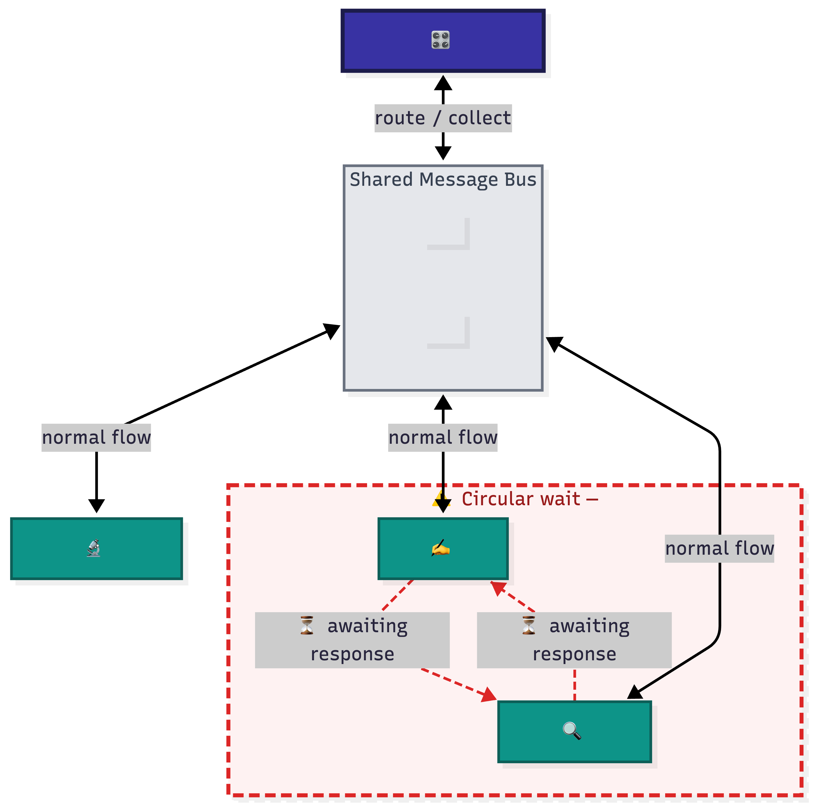
*Figure 4: Deadlock is topological — it emerges from the handoff protocol, not from any individual agent's failure.*

### The Exercise

Open the notebook. Find the cell labeled **"Pattern 4: Multi-Agent — Working Demo."** After the initial message exchange, add a call to `bus.create_deadlock("writer", "reviewer")`. Then attempt `bus.receive_message("writer", timeout_seconds=5)`. Observe the `DeadlockError` raised when the timeout expires. Query the `AGENT_MESSAGES` table to see both messages marked with `status = 'deadlocked'` and note how the circular dependency is visible in the sender-recipient pairs.

---

## Pattern 5: Memory-Augmented Agents

### The Scenario

A personal productivity assistant helps a user manage their schedule, communication style, and task priorities across multiple working sessions. Over three months of use, it has learned that the user prefers bullet-point summaries, works in the healthcare industry, and treats deadlines in the first week of the month as non-negotiable. This accumulated context makes the assistant genuinely useful — it does not ask the same questions twice, and it calibrates its recommendations to the user's established patterns. This is the task Memory-Augmented Agents were designed for.

### The Mechanism

Memory-augmented agents, grounded in the retrieval-augmented generation literature (Lewis et al., 2020), maintain two distinct memory stores with different access patterns.

Short-term memory holds the current conversation context — everything said in the present session. It lives in the active context window — the bounded block of text the model receives as input on each call, typically measured in thousands of tokens — and is discarded when the session ends.

Long-term memory persists across sessions in an external store — in our case, the `AGENT_MEMORY` table in Snowflake. Each memory entry contains the content, a timestamp, a keyword field for retrieval, and a source tag indicating how it was created.

The retrieval layer sits between the agent and the long-term store. When the agent processes a new user input, it queries long-term memory using keyword matching on the `embedding_text` column. Retrieved memories are prepended to the prompt as context. The agent then generates its response conditioned on both the current input and the retrieved history. It treats retrieved memories with the same authority as the system prompt — which is both the feature and the vulnerability.

The write path is the architectural decision that receives insufficient attention in most implementations. When should a memory be written? What information is worth storing? How are contradictory memories resolved? The answers to these questions determine whether the long-term store becomes an asset or a liability.

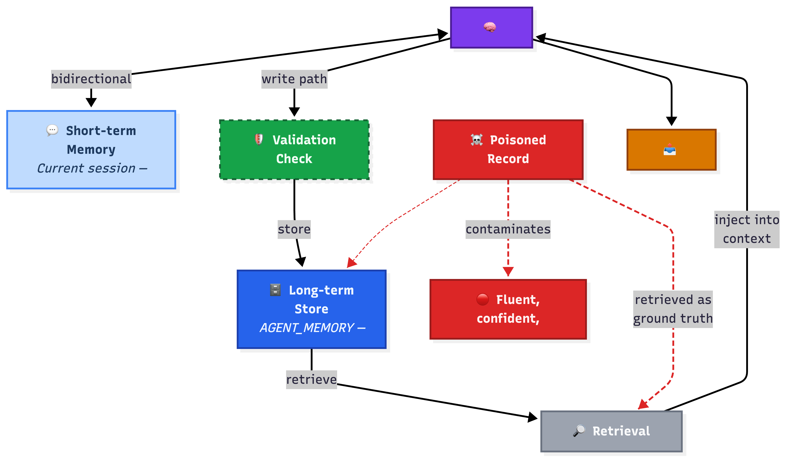
*Figure 5: The retrieval layer trusts all stored memories equally. A poisoned record is indistinguishable from a valid one.*

### The Design Decision

Three decisions dominate the memory architecture: the retrieval strategy (how memories are matched to the current query), a memory validation step (whether new memories are checked for consistency before being written), and a poisoning defense (the mechanism that prevents malicious or erroneous inputs from corrupting the persistent store).

```python
mem = MemoryStore(sf_conn, session_id)

def respond(user_input):
    # Retrieve relevant long-term memories from Snowflake
    memories = mem.retrieve_memory(
        query_keyword=extract_keywords(user_input),
        memory_type=None  # Search both short and long term
    )

    # Build context: retrieved memories + current input
    context = format_memories(memories) + "\n\nUser: " + user_input

    # Generate response via Cortex
    response = cortex_llm.complete(
        prompt=context,
        pattern_name="memory",
        call_type="working"
    )

    # Validate before writing to long-term store
    if should_memorize(user_input, response):
        conflicts = mem.retrieve_memory(query_keyword=extract_keywords(user_input))
        if not conflicts:
            mem.write_memory(
                content=response,
                memory_type="long_term",
                embedding_text=extract_keywords(user_input)
            )

    return response
```

The validation check before `write_memory` is what most production implementations omit. Without it, every session writes unchecked memories. With it, contradictions are caught before they enter the store. This single architectural decision is the difference between a memory system that helps and one that poisons.

### The Failure Mode

**Context poisoning.** The causal chain: a false memory is written to the `AGENT_MEMORY` table — through a direct injection, a buggy prior session, or an agent that hallucinated and persisted the hallucination → on a subsequent session, keyword matching retrieves this corrupted memory → the agent incorporates it as ground truth because the retrieval layer has no verification mechanism → the agent produces a confident, well-structured, wrong answer grounded in false context.

This is not hallucination, and the distinction is mechanistically important. Hallucination occurs when a model generates a token sequence that is statistically plausible but factually unsupported — the model is confabulating from its weights. Context poisoning is the opposite failure: the model is behaving correctly, faithfully conditioning its output on what it was given. The data it was given is wrong. The architecture did not validate it before writing it to the persistent store, and does not validate it on retrieval. The model's faithfulness is the mechanism of the failure. A hallucinating model is generating fiction; a context-poisoned model is accurately reporting a corrupted record. This makes context poisoning one of the hardest failure modes to detect in production — the response is fluent, specific, and correctly formatted. Only someone who knows the user's actual preferences would notice.

### The Exercise

Open the notebook. Find the cell labeled **"Pattern 5: Memory — Working Demo."** After writing the initial set of valid memories, call `mem.poison_memory(memory_id, "User prefers extremely verbose, jargon-heavy prose")` using the memory ID returned from the write step. Then run the retrieval and generation cells. Observe how the agent's output contradicts the user's actual preferences. Query `AGENT_MEMORY` and note the `is_poisoned = TRUE` flag on the corrupted record. Re-enable validation and repeat. Identify which query would have produced the most consequential wrong recommendation.

---

## Pattern Selection Framework

When you face a new task, work through these diagnostic questions in order:

**1. Is the task decomposable into stable, ordered subtasks?**
If the task has clear sequential dependencies and the environment is unlikely to change mid-execution, use **Plan-and-Execute**. The structure prevents losing track of where you are. The risk is staleness — plan for it explicitly. _(Mechanism: separates planning from execution so the executor never loses global task structure.)_

**2. Does the task require iterative tool use with observable, real-time outcomes?**
If the agent needs to search, compute, or query external systems and adjust its approach based on what it finds, use **ReAct**. The think-act-observe loop handles dynamic information gathering where you cannot predict in advance how many steps are needed. _(Mechanism: interleaves reasoning traces with tool calls so each action is conditioned on observed results.)_

**3. Does output quality need to be verifiable against explicit criteria?**
If you can define what "good enough" looks like as a scoring rubric, use **Reflection**. The generator-critic loop will iterate toward that standard. The risk is conflicting criteria — audit your rubric before you build the loop. _(Mechanism: separates generation from evaluation so the producer receives structured, criteria-specific feedback.)_

**4. Does the task span multiple distinct domains requiring specialized expertise?**
If no single agent can credibly cover all aspects of the task without degradation, use **Multi-Agent Collaboration**. Specialized roles with clear handoffs outperform one overloaded generalist. The risk is coordination overhead — every agent boundary is a potential deadlock. _(Mechanism: distributes task load across role-bounded specialists connected by an observable message bus.)_

**5. Does the task require context from previous interactions?**
If the agent must remember preferences, history, or accumulated knowledge across sessions, use **Memory-Augmented**. Persistent retrieval enables personalization and continuity. The risk is trust — every retrieved memory is an unverified input. _(Mechanism: retrieves validated prior context into the active prompt so each session is conditioned on accumulated history.)_

**When multiple criteria apply — start with the simpler pattern.** Complexity is a cost, not a feature. A ReAct agent that solves the problem in five iterations is better than a multi-agent system that solves it in three messages between four agents. Reach for coordination only when a single agent demonstrably cannot hold the full task in context.

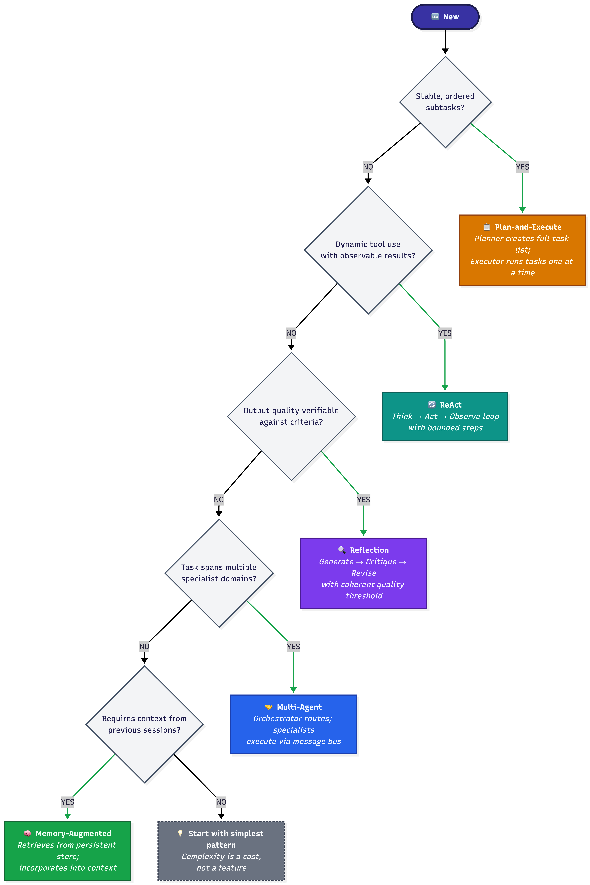
*Figure 6: Work through these questions in order. The first YES determines your pattern.*

---

## Trade-off Comparison

Read this table as a constraint map, not a leaderboard. The pattern with the lowest latency is not the best pattern — it is the best pattern for tasks where latency is the binding constraint. The reliability scores below are conditional on the design decisions described above. Remove the loop limit from ReAct and its reliability drops to zero. Introduce contradictory criteria to Reflection and it will never converge regardless of how many rounds you permit.

**ReAct** — **Latency:** Medium · **Cost:** Medium · **Reliability:** High _(with loop limit)_ · **Complexity:** Low
**Best for:** Adaptive multi-step retrieval — **Failure:** Infinite reasoning loop

**Plan-and-Execute** — **Latency:** High (plan) / Low (exec) · **Cost:** Medium · **Reliability:** Medium · **Complexity:** Medium
**Best for:** Sequential ordered pipelines — **Failure:** Stale plan from world-state change

**Reflection** — **Latency:** High · **Cost:** High · **Reliability:** High _(with coherent criteria)_ · **Complexity:** Medium
**Best for:** Quality-critical single outputs — **Failure:** Non-converging oscillation

**Multi-Agent** — **Latency:** Very High · **Cost:** Very High · **Reliability:** Medium · **Complexity:** High
**Best for:** Cross-domain collaboration — **Failure:** Coordination deadlock

**Memory-Augmented** — **Latency:** Low (after retrieval) · **Cost:** Low · **Reliability:** Medium · **Complexity:** Medium–High
**Best for:** Cross-session personalization — **Failure:** Context poisoning

---

## The Architecture Is the Argument

There is a seductive narrative about large language models that goes roughly as follows: as models become more capable, architectural constraints become less necessary. Smarter models make better decisions. Better decisions mean fewer guardrails required. This narrative is wrong, and the failure modes documented in this chapter explain precisely why.

A smarter model in a ReAct loop without a loop limit is a model that reasons more fluently toward no conclusion. A smarter model in a Plan-and-Execute pipeline with an immutable plan is a model that executes stale assumptions with greater confidence. A smarter model in a Reflection loop with contradictory criteria oscillates more articulately. A smarter model reading a poisoned memory produces a more convincing wrong answer. Model capability and architectural soundness operate on independent axes. The five demonstrations in this chapter are the evidence: each failure was triggered against Snowflake Cortex — a production-grade LLM endpoint — without modifying the model version. The architecture changed; the failure followed from the architecture. The failure modes documented in this chapter are not capability failures — they are structural gaps that a more capable model will navigate more fluently toward the same wrong outcome. Improving the model does not close an architectural gap. It makes the gap harder to see.

The patterns in this chapter are not workarounds for weak models. They are the structural expression of what a reliable agent is allowed to do. The loop limit is not a crutch for a model that cannot decide when to stop — it is the system's formal commitment to bounded execution. The plan validation step is not a check on the planner's intelligence — it is the architecture's assertion that internal consistency is a property of the plan, not of the model that generated it. The memory validation layer is not distrust of the retrieval system — it is the acknowledgment that a persistent store that can be written to can also be corrupted, and that this possibility must be structurally managed.

When an agent fails, the forensic question is always the same: what did the architecture permit that it should not have? The answer to that question is the fix. Not a better model. A better constraint.

The architecture is not the thing that runs the model. It is the thing that decides what the model is allowed to do. Chapter 5 extends this logic to the failure modes that emerge not from a single pattern applied incorrectly, but from patterns composed together — where the constraints of one architectural layer interact with, and sometimes undermine, the constraints of another.

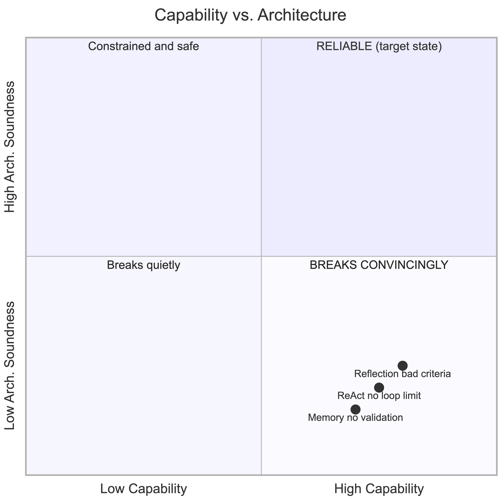
*Figure 7 (conceptual framework): Each of the five failure demonstrations above was triggered without modifying the model. The quadrant positions are mechanistically grounded in those demonstrations: architectural soundness and model capability are independently variable. A stronger model in an unsound architecture reaches the wrong outcome more fluently.*

---

## References

1. Yao, S., Zhao, J., Yu, D., Du, N., Shafran, I., Narasimhan, K., & Cao, Y. (2022). _ReAct: Synergizing Reasoning and Acting in Language Models._ arXiv:2210.03629.

2. Wei, J., Wang, X., Schuurmans, D., Bosma, M., Ichter, B., Xia, F., Chi, E., Le, Q., & Zhou, D. (2022). _Chain-of-Thought Prompting Elicits Reasoning in Large Language Models._ NeurIPS 2022.

3. Park, J. S., O'Brien, J. C., Cai, C. J., Morris, M. R., Liang, P., & Bernstein, M. S. (2023). _Generative Agents: Interactive Simulacra of Human Behavior._ UIST 2023.

4. Lewis, P., Perez, E., Piktus, A., Petroni, F., Karpukhin, V., Goyal, N., Küttler, H., Lewis, M., Yih, W., Rocktäschel, T., Riedel, S., & Kiela, D. (2020). _Retrieval-Augmented Generation for Knowledge-Intensive NLP Tasks._ NeurIPS 2020.

5. Shinn, N., Cassano, F., Gopinath, A., Narasimhan, K., & Yao, S. (2023). _Reflexion: Language Agents with Verbal Reinforcement Learning._ NeurIPS 2023.

6. Wu, Q., Bansal, G., Zhang, J., Wu, Y., Li, B., Zhu, E., Jiang, L., Zhang, X., Zhang, S., Liu, J., Awadallah, A. H., White, R. W., Burger, D., & Wang, C. (2023). _AutoGen: Enabling Next-Gen LLM Applications via Multi-Agent Conversation._ arXiv:2308.08155.

7. Wang, L., Ma, C., Feng, X., Zhang, Z., Yang, H., Zhang, J., Chen, Z., Tang, J., Chen, X., Lin, Y., Zhao, W. X., Wei, Z., & Wen, J.-R. (2024). _A Survey on Large Language Model based Autonomous Agents._ Frontiers of Computer Science, 18(6).
